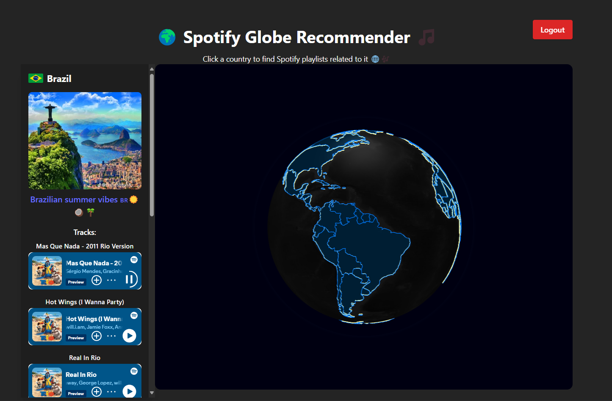

# Spotify Globe Recommender

A global music recommendation web app that uses the Spotify API to recommend tracks from different countries based on your audio preferences — visualized on a 3D interactive globe!

---

## Features

- Interactive 3D globe to explore music by country
- Customize recommendations using audio features (energy, danceability, etc.)
- Real-time Spotify API integration

---

## Tech Stack

- **Frontend**: React, Three.js, Globe.gl, Tailwind CSS
- **API**: Spotify Web API
- **Tools**: Axios, Query-string
- **Backend**: Node, Vercel
---
